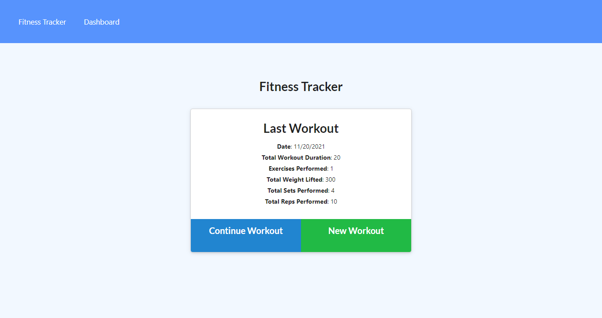

# Fitness Tracker
[Link Here](https://warc-out.herokuapp.com/?id=619b22559d997c19a4f4a57a)
## Description

* I want to be able to view create and track daily workouts.
* I want to be able to log multiple exercises in a workout on a given day.

## Table of Contents (Optional)

- [Installation](#installation)
- [Usage](#usage)
- [Credits](#credits)
- [License](#license)

## Screenshot

## Usage
Create a new workout and input the requested information.

# Credits
## Github

chuck2076

bmalbright

damienluzzo33

echo1826

## License

 MIT

## Badges

 
